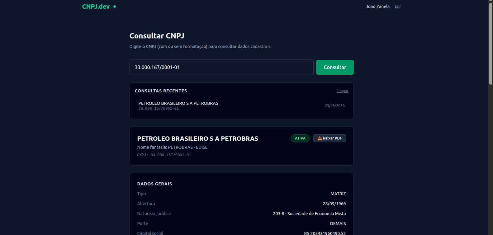
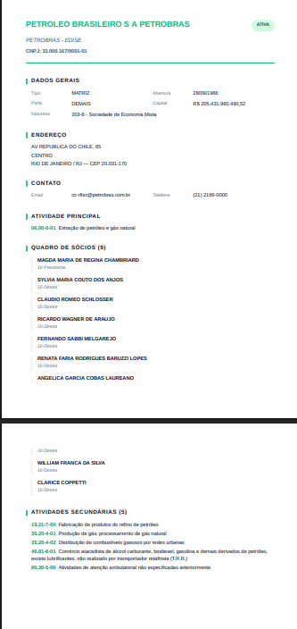

<div align="center">

# CNPJ.dev — Frontend

**Interface web para consulta de CNPJ em tempo real.**

[](https://react.dev/)
[](https://www.typescriptlang.org/)
[](https://vite.dev/)
[](https://tailwindcss.com/)
[](LICENSE)

[🌐 **Demo ao vivo**](https://cnpj.jpzsistemas.com.br) · [📦 **Backend (Go)**](https://github.com/jpzanalista/cnpj-api-go)

</div>

---

## 📌 Visão geral

Frontend SPA do projeto **CNPJ.dev**. Permite consultar dados cadastrais de empresas brasileiras a partir do CNPJ, com atualizações em tempo real via WebSocket e exportação para PDF.

A arquitetura completa do sistema (backend Go, fila RabbitMQ, worker, cache PostgreSQL, hub WebSocket, deploy) está documentada no [repositório do backend](https://github.com/jpzanalista/cnpj-api-go).

## 🎬 Demo

| Tela de login | Dashboard com consulta | PDF gerado |
|:---:|:---:|:---:|
|  |  |  |

## ✨ Funcionalidades

- **Login com Google** — integração via Google Identity Services (`@react-oauth/google`)
- **Formulário com máscara** — formatação automática do CNPJ enquanto digita, validação antes de enviar
- **Atualizações em tempo real** — WebSocket nativo com reconexão automática, indicador visual no header
- **Geração de PDF vetorial** — texto selecionável, layout estruturado por seções, paginação automática (`@react-pdf/renderer`)
- **Histórico de consultas** — últimas 10 consultas em `localStorage`, com clique para reconsultar
- **Responsivo** — layout mobile-first com breakpoints `sm:` do Tailwind
- **Routing client-side** — `react-router-dom` v7 com proteção de rota autenticada
- **JWT persistido** — token em `localStorage`, hidratação automática no boot

## 🛠️ Stack

| Camada | Tecnologia | Versão |
|---|---|---|
| Biblioteca UI | [React](https://react.dev/) | 19.2 |
| Linguagem | [TypeScript](https://www.typescriptlang.org/) | 6.0 |
| Bundler | [Vite](https://vite.dev/) | 8.0 |
| Estilização | [Tailwind CSS](https://tailwindcss.com/) | 4.3 |
| Routing | [react-router-dom](https://reactrouter.com/) | 7.15 |
| OAuth Google | [@react-oauth/google](https://github.com/MomenSherif/react-oauth) | 0.13 |
| Geração de PDF | [@react-pdf/renderer](https://react-pdf.org/) | 4.5 |
| Lint | [ESLint](https://eslint.org/) (flat config) | 10.3 |
| Formatação | [Prettier](https://prettier.io/) | 3.8 |

**Container:** Docker multi-stage (`node:22-alpine` builder com `npm ci + tsc + vite build` → `nginx:1.27-alpine` runtime servindo `dist/`). Imagem final **~22 MB** (SPA estática + nginx + config customizado).

## 🚀 Como rodar localmente

**Pré-requisitos:** Node.js 22+ e npm.

```bash
# 1. Clone
git clone https://github.com/jpzanalista/cnpj-web-react.git
cd cnpj-web-react

# 2. Instale dependências
npm install

# 3. Configure variáveis de ambiente
cp .env.example .env
# Edite .env e preencha:
#   VITE_API_URL=http://localhost:8080    (backend rodando local)
#   VITE_GOOGLE_CLIENT_ID=...              (mesmo Client ID do backend)

# 4. Suba o servidor de desenvolvimento
npm run dev
# Acesse http://localhost:5173
```

**Importante:** o backend precisa estar rodando ([instruções aqui](https://github.com/jpzanalista/cnpj-api-go#-como-rodar-localmente)) e o `localhost:5173` precisa estar registrado nas **Authorized JavaScript origins** do seu OAuth Client ID no Google Cloud Console.

## 🏗️ Build de produção

```bash
npm run build       # gera dist/
npm run preview     # serve dist/ em localhost:4173 para conferência
```

O Vite faz **tree-shaking**, **minificação** e **code-splitting** automaticamente. Os assets gerados têm hash no nome (`index-Abc123.js`) — ideal para cache imutável de longo prazo no CDN/nginx.

## 🐳 Deploy em produção

O deploy usa `docker compose` no VPS, conectando o serviço web a uma rede externa `proxy_network` onde rodam **[nginx-proxy](https://github.com/nginx-proxy/nginx-proxy)** e **[acme-companion](https://github.com/nginx-proxy/acme-companion)** (HTTPS automático via Let's Encrypt).

Pontos importantes:

- O Vite faz **inline em build-time** das `import.meta.env.VITE_*`. Por isso o Dockerfile recebe `ARG VITE_API_URL` e `ARG VITE_GOOGLE_CLIENT_ID` e o `docker-compose.prod.yml` os passa via `build.args`. Não dá pra trocar essas variáveis em runtime — precisa rebuildar.
- O [`nginx.conf`](nginx.conf) cuida do **SPA routing** (`try_files $uri $uri/ /index.html`), **gzip**, e **cache longo** em `/assets/` (1 ano, `immutable`) com `no-store` no `index.html` (para deploys refletirem imediato).

Deploy no VPS:
```bash
docker compose -f docker-compose.prod.yml --env-file .env.production up -d --build
```

Arquivos relevantes:

- [`Dockerfile`](Dockerfile) — multi-stage com build args para Vite
- [`nginx.conf`](nginx.conf) — config nginx para SPA estática
- [`docker-compose.prod.yml`](docker-compose.prod.yml) — serviço web na `proxy_network`
- [`.env.production.example`](.env.production.example) — template das variáveis

## 📁 Estrutura

```
cnpj-web-react/
├── src/
│   ├── components/         # CNPJForm, CNPJResult, CNPJPDF, HistoryList
│   ├── contexts/           # AuthContext + AuthProvider
│   ├── hooks/              # useWebSocket, useHistory
│   ├── lib/                # api.ts (fetch wrapper), format.ts (máscara CNPJ)
│   ├── routes/             # Login, Dashboard
│   ├── App.tsx             # providers + router
│   └── main.tsx            # entrypoint
├── public/                 # assets estáticos (favicon)
├── docs/screenshots/       # imagens usadas no README
├── index.html              # HTML raiz (com preconnect ao Google GIS)
├── Dockerfile              # multi-stage build (Vite → nginx)
├── nginx.conf              # SPA routing + gzip + cache
├── docker-compose.prod.yml # stack de produção
├── eslint.config.js        # flat config (ESLint 10)
└── vite.config.ts          # Vite + Tailwind plugin
```

## 🧠 Notas técnicas

### Por que Tailwind CSS v4?

A v4 traz **build-time engine reescrita** (mais rápida) e **zero-config**: não precisa mais de `tailwind.config.js`, é descoberta automática via `@import "tailwindcss"` no CSS principal. Plugin oficial para Vite é first-class.

### Por que `@react-pdf/renderer` em vez de gerar PDF no backend?

- **PDF vetorial no cliente** — texto selecionável e copiável (não é imagem rasterizada)
- **Custo zero no servidor** — geração roda no browser do usuário
- **Layout declarativo** — componentes parecidos com React (`<Document>`, `<Page>`, `<Text>`)
- **Trade-off:** bundle aumenta ~600 KB. Aceitável para um portfolio focado em demonstrar capacidade visual.

### Por que JWT em `localStorage` em vez de cookie?

Como o frontend e o backend rodam em **subdomínios diferentes** (`cnpj.jpzsistemas.com.br` e `api.cnpj.jpzsistemas.com.br`), cookies cross-subdomain exigiriam configuração específica (`SameSite=None; Secure; Domain=.jpzsistemas.com.br`). Para um projeto pessoal de portfolio, `localStorage` + envio manual no header `Authorization: Bearer` é mais simples. **Em produção real com risco de XSS**, cookies HttpOnly seriam a escolha mais segura.

### Por que preconnect/preload para `accounts.google.com`?

O script Google Identity Services (`gsi/client`) só é injetado quando o componente `<GoogleLogin>` monta — isso atrasava em ~5s a aparição do botão de login. Adicionando `<link rel="preconnect">` + `<link rel="preload">` no `<head>`, o navegador inicia DNS + handshake + download em paralelo ao parse do HTML, derrubando o tempo para ~1s.

## 🗺️ Próximos passos

- [ ] Skeleton de loading enquanto `<GoogleLogin>` renderiza
- [ ] Testes com Vitest + React Testing Library
- [ ] PWA (manifest + service worker para uso offline do cache)
- [ ] Internacionalização (i18n) — atualmente apenas pt-BR

## 📄 Licença

Distribuído sob a licença [MIT](LICENSE).

---

<div align="center">

Desenvolvido por **João Zanela**

</div>
